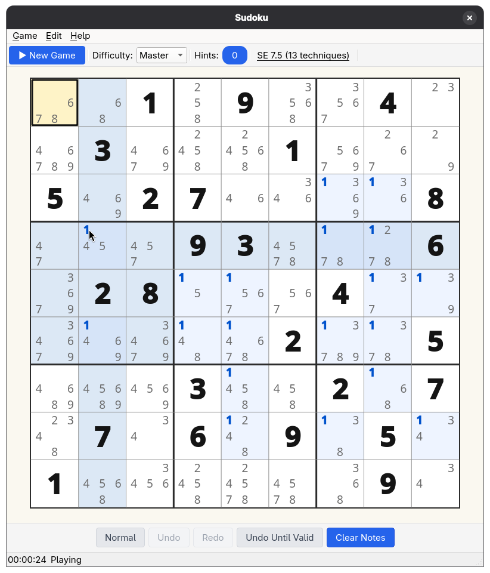
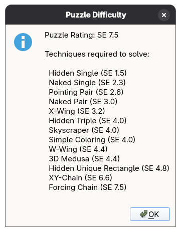

# Sudoku C++

[](https://github.com/darkstar79/sudoku/actions/workflows/ci.yml)
[](https://github.com/darkstar79/sudoku/actions/workflows/nightly.yml)

An offline Sudoku game built with C++23 and Qt6 for desktop users who prefer keyboard navigation and offline-only operation.

This project is entirely **vibe coded** using [Claude Code](https://docs.anthropic.com/en/docs/claude-code) — no manual coding involved. It serves as a personal experiment to explore what's possible with AI-assisted development and how to work effectively with Claude Code on a non-trivial C++ codebase.






## Features

- Puzzle generation with 5 difficulty levels and guaranteed unique solutions
- 54 solving strategies powering difficulty rating and puzzle generation
- Training mode for learning solving techniques *(experimental — enable in Settings → Experimental)*
- Custom puzzles: paste-import an 81-character string, or enter givens manually in edit mode
- Copy current puzzle to clipboard, look up the next step by technique
- Automatic difficulty rating for imported and edited puzzles
- Undo/redo, pencil marks, keyboard navigation
- Encrypted save/load (YAML + zlib + libsodium)
- Statistics tracking
- Localization (English, German)
- SIMD-accelerated solver (AVX2/AVX-512)

## Platform Support

The lines below describe *different strengths of claim*. "Tested" means the maintainer personally exercises the app there; "CI-built" means GitHub Actions builds and runs the test suite but no human verifies UX polish; "packaged downstream" means a third party builds it; "dev target" means it builds and runs but is not a supported release platform.

- **Linux (Fedora)** — primary development platform. All interactive testing by the maintainer happens here.
- **Linux (Ubuntu 24.04)** — built and full test suite run in GitHub Actions CI on every push. Not interactively exercised by the maintainer.
- **Windows 11** — installer artifact attached to each release. Built and tested in CI on `windows-2025` (per push to `main` and on demand); smoke-tested by the maintainer on a Win11 secondary machine before each release tag. Not a daily-driver environment — please file issues if you hit anything.
- **Linux (openSUSE)** — RPM snapshots produced downstream via the [openSUSE Build Service](https://build.opensuse.org/) (namespace `home:AndnoVember:LXQt:Qt6`). Built and validated by the downstream packager, not directly by the project.
- **macOS** — **not a supported release platform for 1.0.** Builds and runs (Homebrew Qt6, apple-clang); exercised on-demand in CI as a development target, but not interactively tested or shipped. See [docs/PACKAGING.md](docs/PACKAGING.md#macos).

Other Linux distributions are likely to work (the Qt6 / CMake / Conan stack is portable) but are not on the test matrix.

## Technology Stack

| | |
|---|---|
| **Language** | C++23 |
| **UI** | Qt6 Widgets |
| **Build** | CMake + Ninja + Conan |
| **Testing** | Catch2 |
| **Architecture** | MVVM |
| **Dependencies** | spdlog, yaml-cpp, zlib, libsodium |

## Prerequisites

- C++23 compatible compiler (GCC 14+, Clang 18+, or MSVC 2022+)
- CMake 3.28+
- Conan 2.0+
- Python 3.8+ (for Conan)
- **ccache** (optional, for faster recompilation)

## Building the Project

### Quick Start (Linux)

```bash
# Install dependencies, configure, and build
conan install . --build=missing
cmake --preset release
cmake --build --preset release

# Run
./build/Release/bin/sudoku
```

### Windows (MSVC + Qt6)

**Prerequisites (one-time, system-wide installs):**

1. **Visual Studio 2022 or 2026** with the *Desktop development with C++* workload — Build Tools or the full IDE both work.
2. **Qt6** (any 6.8+) via the [Qt Online Installer](https://www.qt.io/download-qt-installer) — **tick the MSVC 2022 64-bit kit specifically**. The MinGW kit is not supported by the build scripts; both kits can coexist if you want MinGW for other work.
3. **Python 3.10+** with [uv](https://github.com/astral-sh/uv) recommended (`winget install astral-sh.uv`). Any `pip`-capable Python works as a fallback.

**One-time setup (Python toolchain in a per-repo venv):**

```powershell
uv venv
.\.venv\Scripts\Activate.ps1
uv pip install -r requirements.txt   # conan + cmake + ninja
conan profile detect --force         # seeds %USERPROFILE%\.conan2\profiles\default
```

`requirements.txt` brings Conan, CMake, and Ninja — no separate downloads. The auto-detected `default` Conan profile is what the build scripts use; no `--profile=msvc-*` flag needed on Windows.

**Sanity-check the toolchain:**

```powershell
conan --version ; cmake --version ; ninja --version
```

**Build and run:**

```powershell
.\scripts\build_windows.ps1                  # Release (default)
.\scripts\build_windows.ps1 -Config Debug    # Debug
.\build\Release\bin\sudoku.exe               # Run
```

The build script auto-detects:

- **Visual Studio** via `vswhere -latest -prerelease` (newest install wins, including 2026 previews).
- **Qt6** via [scripts/find_qt6.ps1](scripts/find_qt6.ps1) — scans `C:\Qt\6.*` for the newest version with an `msvc2022_64` kit (proper version sort, so 6.11 ranks above 6.9). Set `$env:QT6_DIR` to override for non-default install locations.

It also passes `-s compiler.cppstd=23` to Conan so dependency builds (Catch2, spdlog, …) stay ABI-compatible with the project's C++23 code, independent of whatever `conan profile detect` chose for your local `default` profile.

**Run the tests:**

```powershell
.\scripts\run_tests_windows.ps1              # Release
.\scripts\run_tests_windows.ps1 -Config Debug
```

**Creating a Windows installer:**

Requires [NSIS](https://nsis.sourceforge.io/Download) (`winget install NSIS.NSIS`).

```powershell
.\scripts\create_installer.ps1
```

**Pre-commit hook:** [scripts/setup-hooks.sh](scripts/setup-hooks.sh) is bash-only; run it from Git Bash, or skip on Windows (CI re-checks formatting on push).

### Build Configurations

```bash
# Release (default)
conan install . --build=missing
cmake --preset release && cmake --build --preset release

# Debug (full debug symbols in all dependencies)
conan install . --profile=gcc-15-debug --build=missing
cmake --preset debug && cmake --build --preset debug

# RelWithDebInfo (optimized + debug symbols for profiling)
conan install . --profile=gcc-15-relwithdebinfo --build=missing
cmake --preset relwithdebinfo && cmake --build --preset relwithdebinfo
```

To build with Clang instead, use the `clang-21-*` profiles (e.g. `clang-21-release`). GCC and Clang share the same build directory per build type — rebuild to switch.

See [CONAN_PROFILES.md](docs/CONAN_PROFILES.md) for profile details.

### AppImage (Linux)

```bash
./scripts/build_appimage.sh
```

### Profile-Guided Optimization

```bash
./scripts/pgo_build.sh
```

## Testing

```bash
# Unit tests (904 test cases)
./build/Release/bin/tests/unit_tests

# Integration tests
./build/Release/bin/tests/integration_tests

# UI tests (Qt6, headless)
QT_QPA_PLATFORM=offscreen ctest --test-dir build/Release -R "^test_" --output-on-failure

# Run specific test case or tag
./build/Release/bin/tests/unit_tests "GameValidator - Move Validation"
./build/Release/bin/tests/unit_tests "[game_validator]"
```

### Code Coverage

```bash
./scripts/coverage.sh              # Quick summary
./scripts/coverage.sh html         # HTML report
```

### Code Quality Tools

```bash
./scripts/format.sh                # Format code (clang-format)
./scripts/format.sh check          # Check formatting only
./scripts/tidy.sh check            # clang-tidy analysis
./scripts/cppcheck.sh              # Cppcheck analysis
./scripts/cpd.sh                   # Copy-paste detection
./scripts/dead-code.sh             # Dead code detection
./scripts/iwyu.sh                  # Include-what-you-use
```

## Project Structure

```
sudoku/
├── src/
│   ├── core/              # Business logic (Model layer)
│   ├── model/             # Domain models
│   ├── view_model/        # Presentation logic
│   ├── view/              # UI rendering (Qt6 Widgets)
│   └── infrastructure/    # Cross-cutting concerns
├── include/               # Shared public headers
├── tests/
│   ├── unit/              # Unit tests (904 test cases)
│   ├── integration/       # Integration tests
│   ├── ui/                # Qt6 UI tests (offscreen)
│   ├── benchmarks/        # Performance benchmarks
│   ├── data/              # Test fixtures
│   └── helpers/           # Test utilities
├── scripts/               # Build and analysis scripts
├── CMakeLists.txt         # Build configuration
└── conanfile.py           # Dependency management
```

## Architecture

The project follows MVVM (Model-View-ViewModel) architecture with strict separation of concerns:

- **Model Layer:** Business logic (GameValidator, PuzzleGenerator, SudokuSolver, SaveManager)
- **ViewModel Layer:** Presentation logic with Observable pattern
- **View Layer:** UI rendering with Qt6 Widgets

Key architectural principles:
- Dependency Injection via interfaces
- Single-threaded design (no mutexes needed)
- Observable pattern for reactive UI updates
- Test-Driven Development (TDD)

## Performance

All puzzle generation runs **single-threaded** — no background workers or thread pools. Performance comes from Zobrist hashing, memoization, SIMD constraint propagation, and runtime CPU dispatch (Scalar/AVX2/AVX-512).

Measured on AMD Ryzen 9 9950X (single core, AVX-512):

- **Easy:** ~0.07ms
- **Medium:** ~0.18ms
- **Hard:** ~0.72ms
- **Expert:** ~0.73ms
- **Master:** ~0.74ms

## Development

### Pre-Commit Hook

```bash
./scripts/setup-hooks.sh
```

Checks GPLv3 license headers and formatting on staged files. Optionally run clang-tidy with `TIDY=1 git commit`.

### Cross-Compiler Testing

```bash
# Build and test with GCC
conan install . --profile=gcc-15-release --build=missing
cmake --preset release
cmake --build --preset release
./build/Release/bin/tests/unit_tests

# Rebuild with Clang (shares build/Release directory)
conan install . --profile=clang-21-release --build=missing
cmake --preset release
cmake --build --preset release
./build/Release/bin/tests/unit_tests
```

## License

This project is licensed under the **GNU General Public License v3.0** (GPLv3) — see the [LICENSE](LICENSE) file for details.

See [ACKNOWLEDGMENTS.md](ACKNOWLEDGMENTS.md) for credits and [THIRD_PARTY_LICENSES.md](THIRD_PARTY_LICENSES.md) for dependency licenses.
